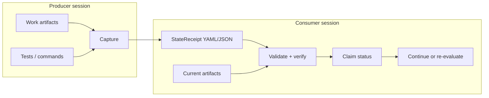
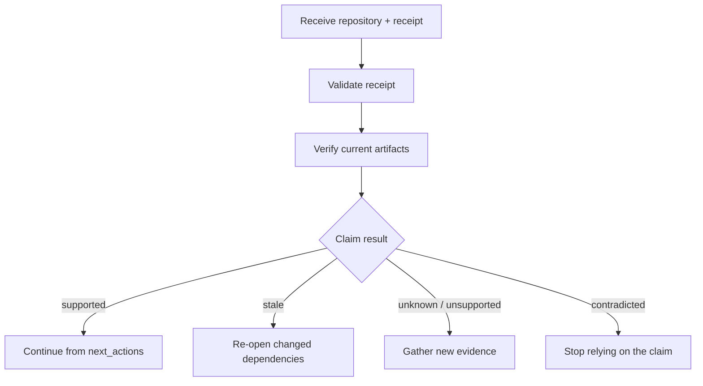

# Architecture and trust boundaries

StateReceipt is a small verification layer between a producer of AI-assisted work and a later consumer of that work. It records exactly which evidence and artifact bytes supported each claim at capture time, then re-checks those dependencies when work resumes.

## Data model

| Element | Purpose | Verified property |
|---|---|---|
| Claim | A bounded statement about the work | References and evaluation rules are valid |
| Evidence | Support for one or more claims | Declared bindings and replay metadata are structurally valid |
| Artifact snapshot | Files a claim or evidence depends on | Current SHA-256/SHA-512 digest matches the captured digest |
| Continuation metadata | Unresolved items and next actions | Preserved as explicit handoff context |
| Predecessor | Link to an earlier immutable receipt | Local chains contain no duplicates, self-links, or cycles |

## Trust boundary

StateReceipt verifies receipt structure, explicit references, artifact integrity, Git snapshot availability, and deterministic freshness. It does not authenticate the producer, prove a natural-language claim true, sandbox commands, or transfer hidden model context.

Normal verification never executes evidence commands. Replay requires both `--replay` and `--trust-receipt`; the latter is an acknowledgement that the caller has reviewed the receipt, not a security guarantee.

## Continuation decision

The architecture remains vendor-neutral: producers and consumers can be Codex, another coding assistant, CI, or a human maintainer.
